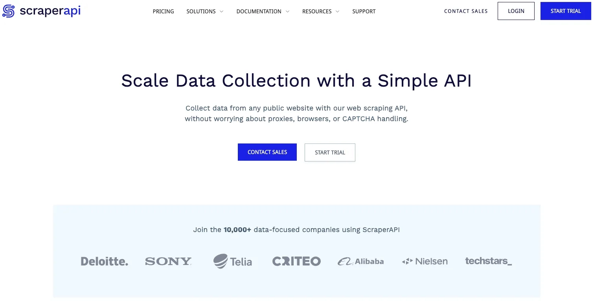

# 动态代理IP：用ScraperAPI让Python爬虫"隐身"

---

现在爬个数据怎么这么难？电商网站、社交平台、金融网站，哪个不是火眼金睛盯着你。除了检查HTTP Headers，现在还搞AI反爬虫——一旦被逮到，轻则弹个人机验证让你点红绿灯，重则直接把你IP封了。IP被封之后？要么换IP，要么歇菜。

代理IP轮换+请求头随机化，是降低被检测概率的常规操作。最近试了一下ScraperAPI这个工具，发现它把这套流程都打包好了——你只管发请求，它自动帮你换IP、改请求头、过验证码。新用户还有1000次免费额度，正好拿来测试。这篇文章就说说怎么用。

---

## ScraperAPI到底是个啥？

简单理解：**它是个加了代理IP池的增强版爬虫接口**。

你给它发一个请求，它帮你：
- 自动轮换代理IP
- 随机修改HTTP请求头
- 处理人机验证（比如验证码）
- 返回目标网页的HTML源码

整个过程对你透明，你就当它是个"会自动变装"的代理服务器就行。

想用的话，先去👉 [ScraperAPI官网](https://www.scraperapi.com/?fp_ref=coupons)注册个账号。点"START TRIAL"，填邮箱密码，登录后就能看到你的API Key，以及各种语言的示例代码。



API Key别泄露，这玩意等于你的流量账户——被别人拿去用了，你的额度就没了。

---

## 用ScraperAPI跑个Python爬虫试试

注册完登录，首页就有你的API Key和示例代码。默认给的是Python版本，直接能跑：

```python
import requests

payload = {
    'api_key': 'Your API key here.',
    'url': 'http://httpbin.org/ip'
}
r = requests.get('https://api.scraperapi.com/', params=payload)
print(r.text)
```

运行一下，httpbin.org的HTML就打印出来了。说明ScraperAPI已经帮你完成了一次"代理爬取"。

---

### 验证一下：它真的用了代理IP吗？

光跑通代码不够，得确认它是不是真的换了IP。

1. 先打开浏览器，访问这个👉 [代理IP在线检测工具](https://spiderbuf.cn/tools/proxy-ip-checker)，看看你本地的真实IP是多少。
2. 把上面代码里的`url`改成检测工具的地址：

```python
import requests

payload = {
    'api_key': 'Your API key here.',
    'url': 'https://spiderbuf.cn/tools/proxy-ip-checker'
}
r = requests.get('https://api.scraperapi.com/', params=payload)
print(r.text)
```

3. 运行代码，等HTML打印出来后，对比一下打印出来的IP和浏览器里看到的IP。

**结果：不一样。**

说明ScraperAPI确实自动用了代理IP，而且用的是高匿代理——目标网站根本看不出你的真实身份。

---

### 注意：它只负责拿HTML，解析数据得你自己来

ScraperAPI的定位很明确：**帮你拿到网页源码，至于从源码里提取数据，那是你的事。**

换句话说，它解决的是"如何不被封IP地拿到HTML"的问题，不是"如何解析HTML"的问题。数据提取还得自己写BeautifulSoup或者正则表达式。

---

## 小结

ScraperAPI就是个"代理IP+反爬虫绕过"的打包服务。你不用自己维护代理池、不用担心IP被封、不用研究各种反爬策略——发个请求，它全帮你搞定。

对于需要从大型网站爬数据的场景来说，这工具上手门槛低，省事。如果你正在被反爬虫折磨，或者懒得自己搭代理池，👉 [试试ScraperAPI](https://www.scraperapi.com/?fp_ref=coupons)——1000次免费额度够你测试了。
